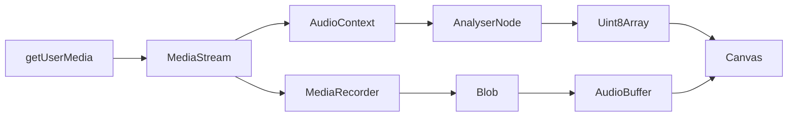

## Introduction

React Voice Visualizer is a comprehensive audio recording and visualization library built on top of the **Web Audio API**. It provides a clean separation between state management (via hooks) and visualization (via components), making it easy to integrate audio recording capabilities into React applications.

## Architecture

The library follows a modular architecture with two primary parts:

<Steps>
  <Step title="Hook Layer - useVoiceVisualizer">
    Manages all recording and playback state, handles audio processing, and provides control functions. This hook encapsulates the complex Web Audio API logic.
  </Step>
  
  <Step title="Component Layer - VoiceVisualizer">
    Renders the visual representation of audio data on a canvas element and provides UI controls. The component is highly customizable with props for colors, dimensions, and behavior.
  </Step>
</Steps>

### Separation of Concerns

```tsx
const App = () => {
  // Hook handles all logic and state
  const controls = useVoiceVisualizer();
  
  // Component handles visualization
  return <VoiceVisualizer controls={controls} />;
};
```

This architecture allows you to:
- Use the hook independently for custom UIs
- Access recording state and controls programmatically
- Customize the visualization component without touching logic

## Data Flow

The library processes audio through a series of Web Audio API nodes:



<Steps>
  <Step title="Audio Capture">
    `navigator.mediaDevices.getUserMedia()` requests microphone access and returns a `MediaStream`
  </Step>
  
  <Step title="Dual Processing">
    The stream is connected to two paths:
    - **MediaRecorder**: Records audio chunks and generates a Blob when stopped
    - **AudioContext + AnalyserNode**: Provides real-time frequency data for visualization
  </Step>
  
  <Step title="Real-time Visualization">
    The AnalyserNode continuously outputs frequency data into a `Uint8Array`, which is rendered on canvas using `requestAnimationFrame`
  </Step>
  
  <Step title="Recording Completion">
    When recording stops, the MediaRecorder produces a Blob, which is decoded into an `AudioBuffer` for playback and waveform generation
  </Step>
</Steps>

## Key Web Audio API Concepts

### AudioContext

The `AudioContext` is the central object for all audio processing:

```typescript
// Created when recording starts (useVoiceVisualizer.tsx:162)
audioContextRef.current = new window.AudioContext();
```

<Info>
The AudioContext creates and connects various audio processing nodes. Learn more in the [Web Audio API documentation](https://developer.mozilla.org/en-US/docs/Web/API/AudioContext).
</Info>

### AnalyserNode

Provides real-time frequency and time-domain analysis:

```typescript
// Create analyser and connect to audio stream (useVoiceVisualizer.tsx:163-169)
analyserRef.current = audioContextRef.current.createAnalyser();
dataArrayRef.current = new Uint8Array(
  analyserRef.current.frequencyBinCount
);
sourceRef.current = audioContextRef.current.createMediaStreamSource(stream);
sourceRef.current.connect(analyserRef.current);
```

The AnalyserNode outputs audio data that drives the live visualization.

### MediaRecorder

Records the audio stream and produces a Blob:

```typescript
// Initialize and start recording (useVoiceVisualizer.tsx:170-175)
mediaRecorderRef.current = new MediaRecorder(stream);
mediaRecorderRef.current.addEventListener('dataavailable', handleDataAvailable);
mediaRecorderRef.current.start();
```

### AudioBuffer

When recording stops, the Blob is decoded into an AudioBuffer:

```typescript
// Process the recorded blob (useVoiceVisualizer.tsx:119-122)
const audioBuffer = await blob.arrayBuffer();
const audioContext = new AudioContext();
const buffer = await audioContext.decodeAudioData(audioBuffer);
setBufferFromRecordedBlob(buffer);
```

The AudioBuffer provides raw PCM data used to generate the static waveform visualization.

## Canvas Rendering

All visualization is rendered on an HTML5 Canvas element:

- **Live Recording**: Uses `drawByLiveStream` to render time-domain data from the AnalyserNode
- **Recorded Audio**: Uses `drawByBlob` to render a static waveform from the AudioBuffer

Both rendering functions paint rounded rectangles representing audio amplitude at specific time intervals.

<Note>
The canvas uses `devicePixelRatio` for crisp rendering on high-DPI displays. The actual canvas width may be 2x or 3x the CSS width (VoiceVisualizer.tsx:352).
</Note>

## Internal Reference Management (v2.x.x)

<Note>
Starting in version 2.x.x, the library manages the audio element reference (`audioRef`) internally. You no longer need to pass `ref={audioRef}` to components manually.
</Note>

The hook uses `useRef` to maintain references to:

- `audioRef` - HTMLAudioElement for playback (useVoiceVisualizer.tsx:53)
- `mediaRecorderRef` - MediaRecorder instance (useVoiceVisualizer.tsx:46)
- `audioContextRef` - AudioContext for processing (useVoiceVisualizer.tsx:47)
- `analyserRef` - AnalyserNode for real-time data (useVoiceVisualizer.tsx:48)
- `canvasRef` - Canvas element for rendering (VoiceVisualizer.tsx:145)

These refs persist across renders and are cleaned up when `clearCanvas()` is called.

## Next Steps

<CardGroup cols={2}>
  <Card title="Recording" icon="microphone" href="/concepts/recording">
    Learn how audio recording works with MediaRecorder
  </Card>
  <Card title="Visualization" icon="waveform" href="/concepts/visualization">
    Understand canvas rendering and audio data processing
  </Card>
  <Card title="Playback" icon="play" href="/concepts/playback">
    Explore audio playback and synchronized visualization
  </Card>
  <Card title="API Reference" icon="code" href="/api/use-voice-visualizer">
    View the complete hook API documentation
  </Card>
</CardGroup>